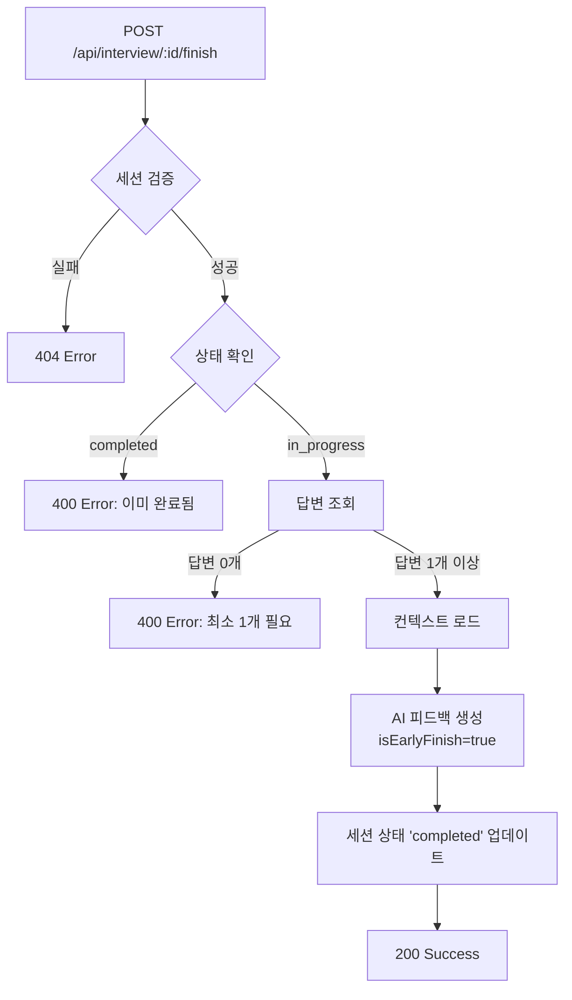

# 면접 조기 종료 기능 구현

## 📋 개요

사용자가 5개 질문을 모두 완료하지 않아도 언제든 면접을 종료하고 부분 피드백을 받을 수 있는 기능입니다.

---

## 🎯 요구사항

### 1. ✅ API 생성/수정
- **엔드포인트**: `POST /api/interview/[id]/finish`
- 5번째 질문이 아니더라도 언제든 호출 가능
- 최소 1개 이상의 질문에 답변해야 호출 가능

### 2. ✅ 부분 데이터 처리
- DB에서 해당 세션의 존재하는 모든 `interview_turns` 조회
- 질문/답변이 5개 미만이라도 피드백 생성 프로세스 진행

### 3. ✅ AI 프롬프트 수정
- 조기 종료 시 `isEarlyFinish = true` 플래그 전달
- AI에게 명시적 지침:
  - 질문 수가 적다고 점수를 깎지 말 것
  - 제공된 질문/답변만 분석
  - 종합 요약에서 면접이 조기 종료되었음을 언급

### 4. ✅ 저장 및 상태 변경
- 생성된 피드백을 `final_feedback_json`에 저장
- 세션 상태를 `'completed'`로 변경
- 히스토리 페이지에 표시

---

## 🏗️ 구현 아키텍처

### 파일 구조

```
lib/
├── openai.ts                        # AI 피드백 생성 로직 수정
└── api-client.ts                    # finishInterview() 메서드 추가

pages/api/interview/
└── [id]/
    └── finish.ts                    # 새로운 조기 종료 API

components/
└── InterviewPage.tsx                # UI 버튼 및 로직 추가
```

---

## 🔧 구현 세부사항

### 1. OpenAI 피드백 생성 함수 수정

**파일**: `lib/openai.ts`

#### 인터페이스 확장

```typescript
export interface FinalInterviewFeedback {
  overall_feedback: string;
  per_turn_feedback: Array<{
    turn_number: number;
    question: string;
    answer: string;
    feedback: string;
  }>;
  is_early_finish?: boolean;           // ✅ 조기 종료 플래그
  total_questions_answered?: number;   // ✅ 답변된 질문 수
}
```

#### 함수 시그니처 수정

```typescript
export async function generateFinalInterviewFeedback(
  context: InterviewContext,
  turns: Array<{ question_text: string; user_answer_text: string }>,
  isEarlyFinish: boolean = false  // ✅ 조기 종료 플래그 추가
): Promise<FinalInterviewFeedback>
```

#### AI 프롬프트 수정

```typescript
const earlyFinishNote = isEarlyFinish 
  ? `\n\n⚠️ **중요**: 사용자가 면접을 조기 종료했습니다 (총 ${totalQuestionsAnswered}개 질문에 답변).
- 질문 수가 적다고 절대로 점수를 깎지 마세요.
- 제공된 질문/답변만 분석하고, "더 많은 질문이 있었다면..."과 같은 가정은 하지 마세요.
- 종합 피드백에서 면접이 조기 종료되었음을 자연스럽게 언급해주세요.
- 답변의 질과 깊이에 집중하여 피드백을 제공하세요.`
  : '';
```

**시스템 프롬프트 개선:**
```typescript
{ 
  role: 'system', 
  content: '당신은 전문 면접관이자 피드백 전문가입니다. 제공된 답변의 질과 깊이에 집중하여 공정하고 건설적인 피드백을 제공합니다.' 
}
```

---

### 2. 조기 종료 API 엔드포인트

**파일**: `pages/api/interview/[id]/finish.ts`

#### 요청/응답

**Request:**
```http
POST /api/interview/123/finish
Authorization: Bearer <JWT_TOKEN>
```

**Response (Success):**
```json
{
  "message": "면접이 조기 종료되었습니다. 피드백이 생성되었습니다.",
  "isCompleted": true,
  "isEarlyFinish": true,
  "sessionId": 123,
  "totalQuestionsAnswered": 2
}
```

**Response (Error - 답변 없음):**
```json
{
  "error": "답변이 하나도 없어 면접을 종료할 수 없습니다. 최소 1개 이상의 질문에 답변해주세요."
}
```

#### 로직 흐름



#### 핵심 코드

```typescript
// 답변이 있는 턴만 조회
const turnsResult = await query(
  `SELECT turn_number, question_text, user_answer_text 
   FROM interview_turns 
   WHERE session_id = $1 AND user_answer_text IS NOT NULL
   ORDER BY turn_number`,
  [sessionId]
);

const turns = turnsResult.rows;

// 최소 1개 이상 답변 필요
if (turns.length === 0) {
  res.status(400).json({ 
    error: '답변이 하나도 없어 면접을 종료할 수 없습니다.' 
  });
  return;
}

// 조기 종료 피드백 생성
const finalFeedback = await generateFinalInterviewFeedback(
  context, 
  turns, 
  true  // ✅ isEarlyFinish = true
);

// 세션 완료 처리
await query(
  `UPDATE interview_sessions 
   SET status = 'completed', final_feedback_json = $1, completed_at = NOW() 
   WHERE id = $2`,
  [JSON.stringify(finalFeedback), sessionId]
);
```

---

### 3. API Client 메서드 추가

**파일**: `lib/api-client.ts`

```typescript
async finishInterview(sessionId: number) {
  return this.request<{
    message: string;
    isCompleted: boolean;
    isEarlyFinish: boolean;
    sessionId: number;
    totalQuestionsAnswered: number;
  }>(`/api/interview/${sessionId}/finish`, {
    method: 'POST',
  });
}
```

**사용 예시:**
```typescript
const response = await apiClient.finishInterview(123);
console.log(response.totalQuestionsAnswered); // 2
```

---

### 4. UI 구현

**파일**: `components/InterviewPage.tsx`

#### 조기 종료 버튼

```tsx
<button
  onClick={handleEarlyFinish}
  disabled={turnNumber < 2 || interviewState === 'processing'}
  className={`px-4 py-2 rounded-lg transition-colors text-sm font-semibold ${
    turnNumber < 2 || interviewState === 'processing'
      ? 'bg-gray-700 text-gray-500 cursor-not-allowed'
      : 'bg-orange-600/20 hover:bg-orange-600/30 border border-orange-600 text-orange-400'
  }`}
  title={
    turnNumber < 2 
      ? '최소 1개 이상의 질문에 답변해야 조기 종료할 수 있습니다' 
      : '현재까지 답변에 대한 피드백을 받고 종료합니다'
  }
>
  ⚡ 조기 종료
</button>
```

**버튼 상태:**
- ✅ `turnNumber >= 2`: 활성화 (오렌지색)
- ❌ `turnNumber < 2`: 비활성화 (회색)
- ❌ `interviewState === 'processing'`: 비활성화

#### 조기 종료 핸들러

```typescript
const handleEarlyFinish = async () => {
  const confirmed = confirm(
    `면접을 조기 종료하시겠습니까?\n\n` +
    `현재까지 ${turnNumber - 1}개의 질문에 답변하셨습니다.\n` +
    `조기 종료하시면 답변하신 내용에 대한 피드백을 받을 수 있습니다.\n\n` +
    `(5개 질문을 모두 완료하지 않아도 피드백을 받을 수 있습니다)`
  );

  if (!confirmed) return;

  try {
    setInterviewState('processing');
    console.log('🔚 면접 조기 종료 요청...');

    const response = await apiClient.finishInterview(sessionId);

    console.log('✅ 조기 종료 완료:', response);
    alert(
      `면접이 조기 종료되었습니다.\n` +
      `${response.totalQuestionsAnswered}개 질문에 대한 피드백이 생성되었습니다.`
    );

    // 정리 및 결과 페이지로 이동
    cleanupMediaStream();
    onInterviewComplete(sessionId);
  } catch (error) {
    console.error('❌ 조기 종료 실패:', error);
    alert('조기 종료 처리 중 오류가 발생했습니다. 다시 시도해주세요.');
    setInterviewState('waiting_next');
  }
};
```

---

## 🎨 UI/UX 흐름

### 조기 종료 버튼 위치

```
┌────────────────────────────────────────────┐
│  AI 모의 면접        [⚡ 조기 종료]        │
├────────────────────────────────────────────┤
│                                            │
│  질문 2 / 5                                │
│                                            │
│  ┌──────────────────────────────────┐     │
│  │  질문이 표시되는 영역             │     │
│  └──────────────────────────────────┘     │
│                                            │
│         [다음 질문 →]                      │
│                                            │
└────────────────────────────────────────────┘
```

### 사용자 흐름

```
1️⃣ 질문 1 답변 → [조기 종료] 버튼 비활성화 (회색)
2️⃣ 질문 2 답변 → [⚡ 조기 종료] 버튼 활성화 (오렌지색)
3️⃣ 사용자 클릭 → 확인 다이얼로그
4️⃣ 확인 → AI 피드백 생성 (로딩 표시)
5️⃣ 완료 → 결과 페이지로 이동
```

### 확인 다이얼로그

```
┌─────────────────────────────────────────────┐
│  면접을 조기 종료하시겠습니까?               │
│                                             │
│  현재까지 2개의 질문에 답변하셨습니다.       │
│  조기 종료하시면 답변하신 내용에 대한       │
│  피드백을 받을 수 있습니다.                 │
│                                             │
│  (5개 질문을 모두 완료하지 않아도           │
│   피드백을 받을 수 있습니다)                │
│                                             │
│         [취소]         [확인]               │
└─────────────────────────────────────────────┘
```

---

## 📊 데이터베이스 스키마

### interview_sessions 테이블

| 필드 | 타입 | 설명 |
|------|------|------|
| `status` | VARCHAR | `'in_progress'` → `'completed'` |
| `final_feedback_json` | JSONB | 피드백 저장 (조기 종료 메타데이터 포함) |
| `completed_at` | TIMESTAMP | 조기 종료 시간 기록 |

### final_feedback_json 구조

**정상 완료:**
```json
{
  "overall_feedback": "...",
  "per_turn_feedback": [...],
  "is_early_finish": false,
  "total_questions_answered": 5
}
```

**조기 종료:**
```json
{
  "overall_feedback": "면접을 조기 종료하셨지만, 2개의 질문에 대한 답변을 바탕으로...",
  "per_turn_feedback": [
    { "turn_number": 1, ... },
    { "turn_number": 2, ... }
  ],
  "is_early_finish": true,
  "total_questions_answered": 2
}
```

---

## 🧪 테스트 시나리오

### 1. ✅ 정상 조기 종료 (2개 질문 후)

**단계:**
1. 면접 시작
2. 질문 1 답변
3. 질문 2 답변
4. "⚡ 조기 종료" 버튼 클릭
5. 확인 클릭

**기대 결과:**
- ✅ AI 피드백 생성 (2개 질문)
- ✅ `is_early_finish: true`
- ✅ 결과 페이지로 이동
- ✅ 히스토리에 "Interview Complete" 표시

**검증:**
```sql
SELECT status, final_feedback_json->'is_early_finish', completed_at
FROM interview_sessions
WHERE id = 123;
```

**예상 결과:**
```
status: 'completed'
is_early_finish: true
completed_at: '2025-11-18 10:30:00'
```

### 2. ❌ 조기 종료 실패 (답변 없음)

**단계:**
1. 면접 시작
2. 질문 1 재생 중 (답변 안 함)
3. "⚡ 조기 종료" 버튼 비활성화 확인

**기대 결과:**
- ❌ 버튼 비활성화 (회색)
- ❌ 클릭 불가
- ✅ 툴팁: "최소 1개 이상의 질문에 답변해야 조기 종료할 수 있습니다"

### 3. ✅ 조기 종료 vs 정상 완료 비교

**시나리오 A (조기 종료):**
- 질문: 2개
- 피드백: "면접을 조기 종료하셨지만..."
- `is_early_finish: true`

**시나리오 B (정상 완료):**
- 질문: 5개
- 피드백: "전반적으로 면접을 잘 진행하셨습니다..."
- `is_early_finish: false`

---

## 🔍 디버깅 가이드

### 콘솔 로그 예시

**클라이언트 (InterviewPage.tsx):**
```
🔚 면접 조기 종료 요청...
📊 현재 턴: 3, 답변 완료: 2개
```

**서버 (pages/api/interview/[id]/finish.ts):**
```
🔚 [면접 조기 종료 요청] User: 5, Session: 123
📊 답변된 질문 수: 2
🤖 AI 피드백 생성 시작 (조기 종료 모드)...
✅ AI 피드백 생성 완료
📝 총 2개 질문에 대한 피드백 생성됨
✅ 면접 세션 완료 처리됨
```

**OpenAI (lib/openai.ts):**
```
[generateFinalInterviewFeedback] isEarlyFinish: true
답변된 질문 수: 2
AI에게 조기 종료 지침 전달
```

### 일반적인 오류

#### 1. "답변이 하나도 없어 면접을 종료할 수 없습니다"

**원인:** `turnNumber < 2` 또는 답변 미제출

**해결:**
```typescript
// 확인
console.log('현재 턴:', turnNumber);
console.log('답변 여부:', recordedAudioRef.current !== null);

// 최소 1개 질문은 답변해야 함
if (turnNumber < 2) {
  // 버튼 비활성화
}
```

#### 2. "이미 완료된 면접입니다"

**원인:** 중복 호출 또는 이미 완료된 세션

**해결:**
```sql
-- 세션 상태 확인
SELECT status FROM interview_sessions WHERE id = 123;

-- 'in_progress'가 아니면 조기 종료 불가
```

#### 3. 피드백에 "질문 수가 적어..." 언급

**원인:** AI가 조기 종료 지침을 무시

**해결:**
- `isEarlyFinish` 플래그 전달 확인
- `earlyFinishNote` 프롬프트 강화
- `temperature` 낮추기 (0.3~0.5)

---

## 📈 성능 고려사항

### AI 피드백 생성 시간

| 질문 수 | 예상 시간 |
|---------|-----------|
| 1개     | ~5초      |
| 2개     | ~7초      |
| 3개     | ~10초     |
| 5개     | ~15초     |

**최적화:**
- ✅ 답변이 있는 턴만 조회 (`WHERE user_answer_text IS NOT NULL`)
- ✅ `temperature: 0.5` (일관성 향상)
- ✅ 불필요한 컨텍스트 제거

---

## 🌐 히스토리 페이지 연동

### 표시 방식

조기 종료된 면접도 정상 완료와 동일하게 표시:

```tsx
<span className="bg-green-900/30 text-green-400 border border-green-600">
  Interview Complete
</span>
```

**메타데이터 확인:**
```typescript
// 결과 페이지에서 조기 종료 여부 확인
const { is_early_finish, total_questions_answered } = finalFeedback;

if (is_early_finish) {
  console.log(`조기 종료됨 (${total_questions_answered}개 답변)`);
}
```

---

## 📚 관련 문서

- **[면접 컨텍스트 기반 질문 생성](./INTERVIEW_CONTEXT_AWARE_REFACTOR.md)** - AI 질문 생성 로직
- **[면접 UI 리팩토링](./INTERVIEW_UI_REFACTOR.md)** - 전체 UI 개선 사항
- **[TTS 오디오 자동 재생](./TTS_AUTOPLAY_FIX.md)** - 오디오 자동 재생 문제 해결

---

## ✅ 체크리스트

### 백엔드

- [x] `lib/openai.ts` - `generateFinalInterviewFeedback()` 함수 수정
- [x] `isEarlyFinish` 플래그 추가 (`boolean` 파라미터)
- [x] AI 프롬프트에 조기 종료 지침 추가
- [x] `FinalInterviewFeedback` 인터페이스 확장
- [x] `pages/api/interview/[id]/finish.ts` 생성
- [x] 세션 검증 로직
- [x] 답변 존재 여부 확인 (최소 1개)
- [x] 컨텍스트 로드 및 피드백 생성
- [x] 세션 상태 'completed' 업데이트

### 프론트엔드

- [x] `lib/api-client.ts` - `finishInterview()` 메서드 추가
- [x] `components/InterviewPage.tsx` - UI 버튼 추가
- [x] 버튼 활성화/비활성화 로직 (turnNumber >= 2)
- [x] 확인 다이얼로그 구현
- [x] 로딩 상태 관리
- [x] 결과 페이지 이동

### 문서

- [x] 조기 종료 기능 문서 작성
- [x] API 명세 작성
- [x] 테스트 시나리오 작성
- [x] 디버깅 가이드 작성

---

## 🚀 배포 체크리스트

- [ ] 로컬 테스트 (1개, 2개, 3개 질문 시나리오)
- [ ] 프로덕션 데이터베이스 백업
- [ ] Vercel 환경 변수 확인
- [ ] Git 커밋 및 푸시
- [ ] `vercel --prod` 배포
- [ ] 프로덕션 테스트
- [ ] 히스토리 페이지 확인
- [ ] 결과 페이지 메타데이터 확인

---

**작성일:** 2025-11-18  
**버전:** 2.2 (Interview Early Finish Feature)  
**작성자:** AI Assistant


