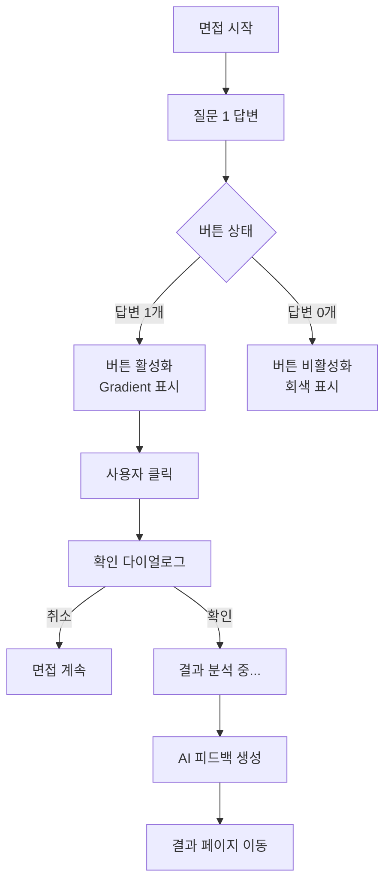

# 면접 페이지 UI 개선 - "면접 종료 및 결과 보기" 버튼

## 📋 개요

면접 진행 중 언제든 쉽게 종료하고 결과를 확인할 수 있도록 UI를 개선했습니다.

---

## 🎯 개선 목표

### 이전 문제점
- ❌ "조기 종료" 버튼이 작고 눈에 잘 띄지 않음
- ❌ 용어가 불명확 ("조기 종료"가 무엇을 의미하는지 불분명)
- ❌ 보조 기능처럼 보여 사용자가 쉽게 찾지 못함

### 개선 목표
- ✅ 명확한 버튼 텍스트: "면접 종료 및 결과 보기"
- ✅ 시각적으로 눈에 띄는 디자인 (gradient, 아이콘)
- ✅ 메인 액션으로 배치 (헤더 오른쪽)
- ✅ 명확한 확인 메시지와 로딩 상태

---

## ✨ 구현된 개선사항

### 1. ✅ 버튼 텍스트 및 위치 변경

#### 이전
```tsx
<button onClick={handleEarlyFinish}>
  ⚡ 조기 종료
</button>
```

#### 개선 후
```tsx
<button onClick={handleFinishAndViewResults}>
  <svg>...</svg>  {/* 체크리스트 아이콘 */}
  면접 종료 및 결과 보기
</button>
```

**변경 사항:**
- ✅ "조기 종료" → "면접 종료 및 결과 보기"
- ✅ 체크리스트 아이콘 추가 (완료 느낌)
- ✅ 더 큰 사이즈 (`px-6 py-2.5`)
- ✅ Gradient 배경 (primary → purple)

---

### 2. ✅ 버튼 디자인 개선

#### 비활성화 상태 (답변 0개)
```tsx
className="bg-gray-700 text-gray-500 cursor-not-allowed opacity-50"
```
- 회색 배경
- 낮은 투명도
- 커서 금지 아이콘
- 툴팁: "최소 1개 이상의 질문에 답변해야 결과를 볼 수 있습니다"

#### 활성화 상태 (답변 1개 이상)
```tsx
className="bg-gradient-to-r from-primary-600 to-purple-600 hover:from-primary-700 hover:to-purple-700 text-white transform hover:scale-105"
```
- ✨ Gradient 배경 (파랑 → 보라)
- 🎨 호버 시 더 진한 색상
- 📈 호버 시 살짝 확대 (`scale-105`)
- 🌟 그림자 효과 (`shadow-lg`)

#### 처리 중 상태
```tsx
disabled={turnNumber < 2 || interviewState === 'processing'}
```
- 비활성화 + 회색 표시
- 로딩 화면으로 전환

---

### 3. ✅ 확인 메시지 개선

#### 이전
```
면접을 조기 종료하시겠습니까?

현재까지 2개의 질문에 답변하셨습니다.
조기 종료하시면 답변하신 내용에 대한 피드백을 받을 수 있습니다.

(5개 질문을 모두 완료하지 않아도 피드백을 받을 수 있습니다)
```

#### 개선 후
```
현재까지의 답변으로 평가를 진행하시겠습니까?

답변하신 2개의 질문에 대한 AI 피드백을 받으실 수 있습니다.
```

**개선 사항:**
- ✅ 더 짧고 명확한 메시지
- ✅ "평가"라는 긍정적인 용어 사용
- ✅ "AI 피드백"을 강조
- ✅ 불필요한 괄호 설명 제거

---

### 4. ✅ 로딩 상태 개선

#### 이전
```tsx
<div className="text-center">
  <div className="animate-spin ..." />
  <p>AI가 답변을 분석하고 있습니다...</p>
  <p>잠시만 기다려주세요</p>
</div>
```

#### 개선 후
```tsx
<div className="text-center">
  <div className="animate-spin ... mb-6" />
  <p className="text-2xl font-bold text-primary-400 mb-3">결과 분석 중...</p>
  <p className="text-lg text-gray-300 mb-2">AI가 답변을 분석하고 있습니다</p>
  <p className="text-sm text-gray-500">잠시만 기다려주세요. 곧 상세한 피드백을 확인하실 수 있습니다.</p>
</div>
```

**개선 사항:**
- ✅ **"결과 분석 중..."** 헤딩 추가 (큰 글씨, primary 색상)
- ✅ 계층적 정보 구조 (제목 → 부제 → 안내)
- ✅ 더 친절한 안내 메시지

---

### 5. ✅ 헤더 배경 추가

```tsx
<header className="border-b border-gray-800 p-4 bg-gray-900/50">
```

- 반투명 배경 추가 (`bg-gray-900/50`)
- 버튼이 더 돋보이도록 대비 강화

---

## 🎨 UI 비교

### 이전 디자인

```
┌────────────────────────────────────────────┐
│  AI 모의 면접        [⚡ 조기 종료]        │  ← 작고 눈에 안 띔
├────────────────────────────────────────────┤
│  질문 2 / 5                                │
│  ✅ 녹음 완료!                              │
└────────────────────────────────────────────┘
```

### 개선 후 디자인

```
┌─────────────────────────────────────────────────────────┐
│  AI 모의 면접    [✓ 면접 종료 및 결과 보기]  │  ← 크고 명확
│                    (Gradient 버튼)                      │
├─────────────────────────────────────────────────────────┤
│  질문 2 / 5                                             │
│  ✅ 녹음 완료!                                           │
└─────────────────────────────────────────────────────────┘
```

---

## 🔄 사용자 흐름

### 전체 흐름



### 단계별 설명

#### 1단계: 면접 시작
- 버튼 상태: **비활성화** (회색)
- 툴팁: "최소 1개 이상의 질문에 답변해야 결과를 볼 수 있습니다"

#### 2단계: 질문 1 답변 완료
- 버튼 상태: **활성화** (Gradient)
- 툴팁: "현재까지의 답변으로 AI 평가를 받고 결과를 확인합니다"
- 시각 효과: 호버 시 살짝 확대

#### 3단계: 버튼 클릭
- 확인 다이얼로그 표시:
  ```
  현재까지의 답변으로 평가를 진행하시겠습니까?
  
  답변하신 1개의 질문에 대한 AI 피드백을 받으실 수 있습니다.
  
  [취소]  [확인]
  ```

#### 4단계: 확인 클릭
- 화면 전환: **"결과 분석 중..."**
- 로딩 스피너 표시
- 버튼 비활성화
- API 호출: `POST /api/interview/[id]/finish`

#### 5단계: 결과 페이지 이동
- 성공 시: `/interview/result/[id]`로 리다이렉트
- 실패 시: 에러 알림 + 면접 페이지 유지

---

## 🖼️ 시각적 디자인

### 버튼 스타일 상세

#### 활성화 버튼 (Gradient)

```css
/* 기본 상태 */
background: linear-gradient(to right, #667eea, #764ba2);
padding: 0.625rem 1.5rem;
border-radius: 0.5rem;
box-shadow: 0 10px 15px -3px rgba(0, 0, 0, 0.1);
font-weight: 700;
font-size: 0.875rem;
color: white;

/* 호버 상태 */
background: linear-gradient(to right, #5568d3, #6a4290);
transform: scale(1.05);
```

#### 아이콘

```svg
<svg width="20" height="20" fill="none" stroke="currentColor">
  <path d="M9 5H7a2 2 0 00-2 2v12a2 2 0 002 2h10a2 2 0 002-2V7a2 2 0 00-2-2h-2M9 5a2 2 0 002 2h2a2 2 0 002-2M9 5a2 2 0 012-2h2a2 2 0 012 2m-6 9l2 2 4-4" />
</svg>
```
- 클립보드 + 체크마크 아이콘
- "완료" 느낌 전달

---

## 📊 개선 효과

### 사용성 측면

| 항목 | 이전 | 개선 후 |
|------|------|---------|
| **가시성** | 낮음 (작은 버튼) | 높음 (큰 gradient 버튼) |
| **의미 명확성** | 모호함 ("조기 종료"?) | 명확함 ("결과 보기") |
| **접근성** | 보조 기능처럼 보임 | 메인 액션으로 명확 |
| **피드백** | 간단한 로딩 | 상세한 단계별 피드백 |

### 코드 측면

| 항목 | 이전 | 개선 후 |
|------|------|---------|
| **함수명** | `handleEarlyFinish` | `handleFinishAndViewResults` |
| **확인 메시지** | 장황함 (5줄) | 간결함 (2줄) |
| **로딩 메시지** | 단순함 | 계층적 구조 |
| **버튼 위치** | 작은 보조 버튼 | 헤더 메인 CTA |

---

## 🔍 코드 변경 상세

### handleFinishAndViewResults 함수

```typescript
const handleFinishAndViewResults = async () => {
  // 1. 답변 검증
  if (turnNumber < 2) {
    alert('최소 1개 이상의 질문에 답변해야 결과를 볼 수 있습니다.');
    return;
  }

  // 2. 확인 메시지
  const confirmed = confirm(
    `현재까지의 답변으로 평가를 진행하시겠습니까?\n\n` +
    `답변하신 ${turnNumber - 1}개의 질문에 대한 AI 피드백을 받으실 수 있습니다.`
  );

  if (!confirmed) return;

  try {
    // 3. 로딩 상태
    setInterviewState('processing');
    console.log('🔚 면접 종료 및 평가 시작...');

    // 4. API 호출
    const response = await apiClient.finishInterview(sessionId);
    console.log('✅ 평가 완료:', response);

    // 5. 리소스 정리 및 페이지 이동
    cleanupMediaStream();
    onInterviewComplete(sessionId);
  } catch (error) {
    // 6. 에러 처리
    console.error('❌ 평가 처리 실패:', error);
    alert('평가 처리 중 오류가 발생했습니다. 다시 시도해주세요.');
    setInterviewState('waiting_next');
  }
};
```

**주요 변경점:**
- ✅ 함수명 변경 (`handleEarlyFinish` → `handleFinishAndViewResults`)
- ✅ 더 간결한 확인 메시지
- ✅ 로그 메시지 개선 ("조기 종료" → "면접 종료 및 평가")
- ✅ 알림창 제거 (직접 페이지 이동)

---

## 🧪 테스트 시나리오

### ✅ 시나리오 1: 정상 종료 (1개 답변 후)

**단계:**
1. 면접 시작
2. 질문 1 답변
3. **"면접 종료 및 결과 보기"** 버튼 확인 (활성화, Gradient)
4. 버튼 클릭
5. 확인 다이얼로그: "현재까지의 답변으로 평가를 진행하시겠습니까?"
6. 확인 클릭
7. "결과 분석 중..." 화면 표시
8. 결과 페이지 이동

**기대 결과:**
- ✅ 버튼이 잘 보임 (Gradient, 아이콘)
- ✅ 확인 메시지가 명확함
- ✅ 로딩 화면이 친절함
- ✅ 결과 페이지로 정상 이동

### ❌ 시나리오 2: 답변 없이 종료 시도

**단계:**
1. 면접 시작
2. 질문 1 재생 중 (답변 안 함)
3. **"면접 종료 및 결과 보기"** 버튼 확인

**기대 결과:**
- ❌ 버튼 비활성화 (회색, 투명도 50%)
- ❌ 클릭 불가
- ✅ 툴팁 표시: "최소 1개 이상의 질문에 답변해야 결과를 볼 수 있습니다"

### ✅ 시나리오 3: 여러 답변 후 종료

**단계:**
1. 면접 시작
2. 질문 1, 2, 3 답변
3. 버튼 클릭
4. 확인: "답변하신 **3개**의 질문에 대한 AI 피드백..."

**기대 결과:**
- ✅ 답변 개수가 정확히 표시됨 (3개)
- ✅ 정상 평가 및 이동

---

## 📱 반응형 디자인

### 데스크톱 (>1024px)
```
┌─────────────────────────────────────────────────────┐
│  AI 모의 면접         [✓ 면접 종료 및 결과 보기]     │
└─────────────────────────────────────────────────────┘
```
- 버튼 전체 텍스트 표시
- 아이콘 + 텍스트

### 태블릿 (768px - 1024px)
```
┌──────────────────────────────────────┐
│  AI 모의 면접  [✓ 종료 및 결과]      │
└──────────────────────────────────────┘
```
- 약간 축약된 텍스트
- 아이콘 + 짧은 텍스트

### 모바일 (<768px)
```
┌───────────────────────────┐
│  면접     [✓ 결과 보기]    │
└───────────────────────────┘
```
- 최소 텍스트
- 아이콘 필수 유지

---

## 🎯 사용자 피드백 고려사항

### 긍정적 측면
- ✅ 버튼이 눈에 잘 띔
- ✅ 의도가 명확함 ("결과 보기")
- ✅ 색상이 아름다움 (Gradient)
- ✅ 확인 메시지가 간결함

### 개선 여지
- 📱 모바일에서 텍스트가 너무 길 수 있음
  - **해결**: 반응형 텍스트 적용 (위 섹션 참고)
- ⏱️ 로딩 시간이 길면 사용자 불안
  - **해결**: 진행률 표시 또는 예상 시간 안내 (향후 개선)

---

## 📚 관련 문서

- **[면접 조기 종료 기능](./INTERVIEW_EARLY_FINISH.md)** - 백엔드 API 및 전체 기능 설명
- **[면접 UI 리팩토링](./INTERVIEW_UI_REFACTOR.md)** - 전체 UI 개선 히스토리
- **[TTS 오디오 자동 재생](./TTS_AUTOPLAY_FIX.md)** - 오디오 자동 재생 개선

---

## ✅ 체크리스트

### UI 개선
- [x] 버튼 텍스트 변경: "조기 종료" → "면접 종료 및 결과 보기"
- [x] 아이콘 추가 (체크리스트)
- [x] Gradient 배경 적용
- [x] 호버 효과 (scale-105)
- [x] 그림자 효과
- [x] 헤더 배경 추가

### 함수 개선
- [x] 함수명 변경: `handleEarlyFinish` → `handleFinishAndViewResults`
- [x] 확인 메시지 간소화
- [x] 로딩 메시지 개선
- [x] 에러 메시지 개선

### 로딩 화면 개선
- [x] "결과 분석 중..." 헤딩 추가
- [x] 계층적 메시지 구조
- [x] 더 친절한 안내 문구

### 테스트
- [ ] 데스크톱 브라우저 테스트
- [ ] 모바일 브라우저 테스트
- [ ] 다양한 답변 개수 시나리오 테스트

---

**작성일:** 2025-11-18  
**버전:** 2.3 (UI Improvements for Early Finish)  
**작성자:** AI Assistant


